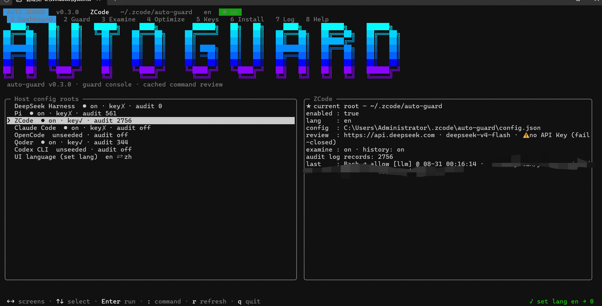

# auto-guard

English | [简体中文](README.zh-CN.md)

A **command-review safety net for AI coding agents**. Before the host executes a command or reads/writes a file, auto-guard decides **allow / deny / ask** using layered static rules, caches, learned rules, audit history and a one-shot LLM review (DeepSeek by default). It is meant to sit on top of full-access mode: dangerous commands are blocked, routine ones pass in milliseconds, and only genuinely uncertain cases reach the LLM or a human.



## Why

- Full-access mode is productive but scary. Existing LLM-based approval mechanisms (Claude Code auto mode, Codex auto-review) send every command to a model, which is slow and expensive.
- In practice most agent shell commands are safe, simple and highly repetitive. So the review prompt is minimal (no context payload), and anything already adjudicated is served from one of several caches. Measured over short-term daily use, **review cost stays around 1–4% of total spend** and keeps dropping as history accumulates.
- Latency is dominated by the layers, not the LLM: whitelist and cache hits return without any model call, so the guard is effectively invisible.

## Install

auto-guard is **not on npm** — the repo is a private pnpm workspace whose packages depend on each other via `workspace:*` (only resolvable inside the workspace), so `npm i -g git+…` cannot work either. Clone the repo and run the TypeScript entries directly with Node ≥ 22.18 (the core has zero runtime dependencies; the SQLCipher audit store is an optional native dependency that falls back automatically when absent). Windows and macOS work exactly the same:

```bash
git clone https://github.com/Ayle5678/auto-guard.git
cd auto-guard
pnpm install
pnpm build                                   # produces dist/ — the zcode/claude/opencode/qoder/codex hooks point at it
node packages/cli/src/auto-guard.ts init     # installer: detects installed hosts, checkbox multi-select, writes integrations
node packages/tui/src/tui.ts                 # the same command surface as a full-screen TUI
# non-interactive: node packages/cli/src/auto-guard.ts init --host pi,zcode --yes
```

Throughout this README, `auto-guard <command>` is shorthand for `node packages/cli/src/auto-guard.ts <command>` (or `node packages/cli/dist/auto-guard.js <command>` once built). To turn the shorthand into a real global command, symlink the entry scripts per the [CLI guide](docs/cli.md).

> **Platform support** ([ADR-0017](docs/adr/0017-platform-support-windows-macos.md)): Windows + macOS. macOS passed the file-by-file code audit (2026-08-30); real-machine verification is in progress — this note upgrades to "verified" only once that concludes. Linux is neither promised nor forbidden (same POSIX paths and fallbacks, unverified).

Interactive `init` leads with the block-letter banner (bilingual tagline) and a bilingual prompt (请选择语言 / Select language — `1` 中文, `2` English). The choice is persisted to the machine default (`~/.auto-guard/config.json`) immediately — later inits never re-ask and `remove` keeps it. The whole product is bilingual (installer, management CLI, engine messages, host-session prompts, LLM decision reasons); resolution everywhere: `AUTO_GUARD_LANG` env → per-host `set lang <zh|en>` → machine default → zh fallback. The `[删除理由]` marker is protocol and stays Chinese.

Every write is shown as a diff first, backs the target up to `*.auto-guard.bak`, and is verified after writing — re-running `init` is idempotent (a block-letter banner with a top-to-bottom cyan→blue→violet gradient and an ANSI-Shadow-style double-line extrusion heads the run on interactive terminals; `NO_COLOR` degrades it to plain text). Start a new session in each installed host afterwards (ZCode / Claude Code / Qoder / Codex hooks have no hot reload) and check `auto-guard guard status`, which renders a status overview of every installed host. `auto-guard list` shows detection evidence and integration status; `auto-guard remove [--host …]` uninstalls (restores backups; your `~/.<host>/auto-guard/` data is kept). Details: [usage manual](docs/usage.md) · [CLI guide](docs/cli.md) · [troubleshooting](docs/troubleshooting.md).

> **⚠ Claude Code users**: tools like **cc-switch / clawd** rewrite `~/.claude/settings.json` wholesale and can wipe the hooks. If the guard goes silent, check that file first, then re-run `auto-guard init --host claude` to restore. Run `node <host-claude>/dist/cli.js guard ping` to verify the hook is alive.

> **⚠ Codex users**: after installing, run `/hooks` once in Codex and trust the two auto-guard entries — untrusted hooks are skipped silently, so the guard looks enabled while doing nothing. Ask-class verdicts land as **denials**: Codex's hook protocol cannot surface a confirmation prompt yet (SPEC 0015).

> **⚠ OpenCode users**: (1) if `opencode --version` reports "postinstall script was not run", fix with `node <global npm>/node_modules/opencode-ai/postinstall.mjs`; (2) `auto-guard remove` keeps the inserted `"*": "ask"` permission rules (ownership cannot be distinguished) — delete them by hand if you want a fully clean uninstall.

Each host's native channel stays fully supported and coexists with the installer:

- **ZCode**: install the plugin (manifest + hooks live in `packages/host-zcode`); `dist/` is prebuilt.
- **Pi**: register the extension (`packages/host-pi/package.json` → `"pi": {"extensions": ["./src/index.ts"]}`).
- **DSH**: install the plugin (`packages/host-dsh`); the `auto-guard` permission preset turns the guard on.
- **Claude Code / OpenCode / Qoder**: installer-only by design (settings.json merge / `plugin` entry + permission rules). Hermes was investigated and deferred — see `.scratch/0004-host-claude-opencode/research/`; the Qoder protocol deep-dive lives in `.scratch/0005-host-qoder/research/`.

Adding a host means one profile plus one adapter package — no installer changes ([guide](docs/new-host.md)).

## Positioning

- **Safety net, not a sandbox.** The guard does not restrict the filesystem; it adjudicates on top of full access and tries not to interrupt normal work. It is not an absolute security boundary — a prompt-injected LLM verdict is possible, which is why high-risk commands are never cached and sensitive file content is never sent for review.
- **Fail-closed everywhere.** Reviewer timeout, missing API key, missing UI — every abnormal path lands on deny or human confirmation, never on silent allow. (An explicit user off-switch always wins; that is the one exception.)
- **Keys never in the repo.** API keys resolve env var → encrypted store (AES-256-GCM, machine-bound) → legacy plaintext field (read-only, never rewritten).
- **Bring your own cheap reviewer.** The review call is one minimal prompt (no context payload) to any OpenAI-compatible endpoint under a dedicated API key — point `apiBase` + `set-api` at a pay-as-you-go provider (DeepSeek, opencode Zen, …) with a small model, and review spend runs on its own meter: pay for what actually gets reviewed, and rule/cache verdicts cost nothing.

## Decision pipeline (shared by all hosts)

Every shell command passes these layers; first match wins:

```text
command (bash / pwsh)
  → File Tracker          write-then-execute: a freshly written script run immediately
                          is materialized and reviewed (sensitive content is not sent to the LLM)
  → Absolute blacklist    hard-deny, cannot be overridden by cache/learned/LLM
  → Directory-delete      denied once; agent retries with [deletion reason]; a low-reasoning
    review                LLM re-reviews exactly once; non-allow goes to a human
  → Sensitive-path guard  command references .env / .ssh / *.pem … → whole command demoted
                          to LLM (never silently allowed, never cached)
  → Compound commands     split on ; && ||; most restrictive sub-verdict wins; state-changing
                          commands (export, cd, trap, git config …) force whole-command LLM review
  → Pure pipelines        judged as one unit: allowed only when every leaf is deterministically
                          safe; any uncertain leaf sends the whole pipeline to the LLM once
  → Static allowlist      default + user-confirmed rules; token-level guard scan for dangerous
    (+ user-confirmed)    flags (git branch -D, find -exec …); substitution/redirect never static
  → Session cache         LRU keyed by session×workspace×command shape
  → Persistent cache      cross-session, workspace-isolated, TTL by risk (low 30d / medium 7d /
                          high never); LLM denies never enter
  → Template cache        learned approvals match parameter variants (--days 7 ≈ --days 8)
  → History layer         recent low-risk allows of the same skeleton with zero denies → allow
  → LLM fallback          unknown commands; any failure fails closed
```

File operations (`write` / `edit` / `read`) are gated by the sensitive-path list only: a hit is ask-only and the content never leaves the machine; everything else passes. Commands outside guard scope pass through untouched.

Two memory behaviors sit on top of the pipeline:

- **Guard Memory** — an LLM deny is never cached; if the same command reappears, it is escalated to a human ask instead of being silently re-judged.
- **Four-state ask** (hosts whose ask UI supports it) — allow once / allow this session / deny with reason / deny this session.

Each decision carries a source tag you can see in notifications: `[Allowlist]`, `[LLM]`, `[Blacklist]`, `[Session cache]`, `[Persistent cache]`, `[Learned]`, `[History]`, `[Delete review]`, `[Write-then-execute]`, `[Sensitive path]`, `[Pre-authorized]`.

### Command classification

| Category | Behavior | Examples | Cached? |
|---|---|---|---|
| Static allowlist | direct allow | `ls`, `git status`, `git diff`, `git commit` | no |
| Absolute blacklist | direct deny | `rm -rf /`, `mkfs`, `dd of=/dev/...` | no |
| Directory-delete review | agent reason + one low-reasoning LLM re-review | `rm -rf ./dist`, `Remove-Item -Recurse` | no |
| User-confirmed | user-declared "always allow" | `git push` | no |
| Cacheable | LLM approval cached by TTL | `npm run build`, `npm test` | yes |
| Always-review | LLM every time; allow gets short session cache | `npm install`, `Invoke-Expression`, `curl \| bash` | session-only, 30 min |
| Unknown | LLM decides; low/medium allow becomes cacheable | everything else | low/medium yes |

### Caching, learning, audit

- **Learned rules** — an offline deterministic analysis of the audit DB distills repeatedly-safe commands into cacheable templates (`learned-rules.json`, lowest priority, never static-allow; every write is backed up and rollbackable). Runs manually or automatically every 15 days; off by default.
- **Guard stats** — in-session counters per layer (LLM calls, cache/rule/history hits). Memory only, reset each session.
- **Audit store** — optional (off by default) local encrypted SQLite of shell-command verdicts: redacted before write, never records file tools or execution output. It is the data source for the history layer and rule learning.

## One decision engine, seven thin host adapters

- **`@auto-guard/core`** — zero-host-dependency engine: decision pipeline, rules, caches, key hydration, audit, history, learned rules, management operations. Only Node built-ins (ADR-0002).
- **`auto-guard` (packages/host-dsh)** — DeepSeek Harness plugin (`tools/pre-execute`, permission-preset switch, SQLCipher audit, settings UI + Typert remote).
- **`@auto-guard/host-pi`** — Pi Coding Agent extension (`tool_call` / `user_bash`, four-state ask).
- **`@auto-guard/host-zcode`** — ZCode PreToolUse hook plugin (one process per call, disk session state, decision history).
- **`@auto-guard/host-claude`** — Claude Code PreToolUse hook adapter (settings.json hooks, NotebookEdit coverage, native confirmation box).
- **`@auto-guard/host-opencode`** — OpenCode permission-system adapter (plugin watches `permission.asked` events, spawns `node` per decision, native TUI ask; guard surface = host ask surface, not full coverage — see [adapter status](#auto-guardhost-opencode--opencode-permission-system-adapter)) — see [ADR-0015](docs/adr/0011-opencode-permission-ask-delegation.md).
- **`@auto-guard/host-qoder`** — Qoder (international IDE) PreToolUse hook adapter (Claude-compatible hook protocol, dual tool-naming mapping, native confirmation box).
- **`@auto-guard/host-codex`** — OpenAI Codex CLI hooks adapter (Claude-compatible `hooks.json` protocol, apply_patch patch-text path extraction; ask-class verdicts land as deny — codex discards the unsupported `"ask"` decision, SPEC 0015).
- **`@auto-guard/cli`** — unified `auto-guard` management CLI + installer.
- **`@auto-guard/tui`** — full-screen interactive management console (`auto-guard-tui`, SPEC 0009 / ADR-0014): zero-dep hand-rolled ANSI TUI covering the whole command surface — installer + guard/set/examine/optimize — plus a `:` command mode for anything the CLI can do. Built for hosts without a settings UI (zcode/claude/opencode/qoder/codex/pi); dsh users welcome too. Every action runs through `runCli`/`runInstallerCommand` (single semantic source); non-TTY starts are refused (exit 2).

All seven hosts run the same pipeline with the same defaults and the same rule files; only the integration shell differs (see [Host adapters](#host-adapters)).

## Host adapters

Each adapter only translates host events into `GuardRequest` and decisions back into the host's decision protocol; all adjudication lives in core. Each host has its own config root — `~/.dsh/auto-guard/`, `~/.pi/auto-guard/`, `~/.zcode/auto-guard/`, `~/.claude/auto-guard/`, `~/.config/opencode/auto-guard/`, `~/.qoder/auto-guard/`, `~/.codex/auto-guard/` — with zero sharing between hosts and zero migration on upgrade.

| Dimension | host-dsh | host-pi | host-zcode | host-claude | host-opencode | host-qoder | host-codex |
|---|---|---|---|---|---|---|---|
| Integration event | `tools/pre-execute` + monotonic guard | `tool_call` + `user_bash` | PreToolUse hook (one process per call) + SessionStart | PreToolUse hook + SessionStart (settings.json, `type: "command"`) | permission system: installer writes `bash/edit/read → "*": "ask"` rules; plugin answers `permission.asked` events | PreToolUse hook + SessionStart (settings.json, `type: "command"`) | PreToolUse hook + SessionStart (hooks.json, `type: "command"`) |
| Decision protocol | PreToolDecision deny/ask + `next()` | `{block, reason}` / input rewrite | stdout JSON `permissionDecision`; allow = silence | stdout JSON `permissionDecision`; allow = silence | spawned CLI verdict `{status}` → `client.permission.reply` (allow→once, deny→reject, ask→no reply) | stdout JSON `permissionDecision`; allow = silence | stdout JSON `permissionDecision`; allow = silence |
| Ask style | host one-shot approval | four-state dialog | delegated to native permission prompt | delegated to native confirmation box | delegated to native TUI (once / always / reject) | delegated to native confirmation box | **lands as deny** — codex discards `"ask"` and continues the call, so asks never ride the wire (headlessFallback: deny) |
| On/off switch | permission preset (`auto-guard`) — the only switch | `/guard on\|off` + `config.enabled` | `config.enabled` (`/guard off` always wins) | `config.enabled` (`guard off` always wins) | `config.enabled` (`guard off` always wins) | `config.enabled` (`guard off` always wins) | `config.enabled` (`guard off` always wins) |
| Session state | memory | memory | disk (`sessions/<sid>/`) | disk (`sessions/<sid>/`) | disk (`sessions/<sid>/`) | disk (`sessions/<sid>/`) | disk (`sessions/<sid>/`) |
| Notifications | page events / context inject | `ctx.ui.notify` / `sendMessage` | pull-based decision history (`guard recent`) | pull-based decision history (`guard recent`) | pull-based decision history (`guard recent`) | pull-based decision history (`guard recent`) | pull-based decision history (`guard recent`) |
| Config root | `~/.dsh/auto-guard/` | `~/.pi/auto-guard/` | `~/.zcode/auto-guard/` | `~/.claude/auto-guard/` | `~/.config/opencode/auto-guard/` | `~/.qoder/auto-guard/` | `~/.codex/auto-guard/` |
| Command surface | settings UI + Typert remote (no slash commands) | `/guard` `/guard-set` `/guard-examine` `/guard-optimize` | `commands/*.md` teaching the model to call the CLI | none (installer + `node …/dist/cli.js guard …`) | none (installer + `node …/dist/cli.js guard …`) | none (installer + `node …/dist/cli.js guard …`) | none (installer + `node …/dist/cli.js guard …`) |
| Packaging | dsh plugin (client.js + typert + cordis.patch.yml) | pi extensions (jiti runs TS directly) | plugin manifest + hooks.json + prebuilt dist | installer writes `~/.claude/settings.json` hooks (nothing else shipped) | installer appends `plugin` entry (dist dir) + permission rules | installer writes `~/.qoder/settings.json` hooks (nothing else shipped) | installer writes `~/.codex/hooks.json` (nothing else shipped) |
| Audit store | SQLCipher (full-db encryption) | SQLCipher (falls back to Light) | Light (node:sqlite + field-level AES-GCM) | Light (node:sqlite + field-level AES-GCM) | Light (node:sqlite + field-level AES-GCM) | Light (node:sqlite + field-level AES-GCM) | Light (node:sqlite + field-level AES-GCM) |

Known coverage caveat (opencode, ADR-0015): your own permission rules that `allow` a pattern bypass the guard entirely, and picking **always** in the TUI adds such a rule for the session — the guard's coverage equals the host's ask surface.

### `auto-guard` (packages/host-dsh) — DeepSeek Harness plugin

- Hooks `tools/pre-execute`; blacklist verdicts additionally register a monotonic `ctx.tools.guard()` veto that the LLM cannot override.
- **On/off = the `auto-guard` permission preset** (`danger-full-access` + ask) in the dialog's permission selector. That is the only switch; nothing else persists an enabled flag.
- Configuration lives in the `auto-guard:` namespace of `~/.dsh/settings.yaml`, edited through a dedicated settings page (grouped fields, masked key display) plus maintenance buttons — analyze now / view rules / rollback learned rules / status / trim audit / export plaintext audit DB / create new audit DB / stats — locally and via **Typert remote**. No slash commands.
- Empty `apiBase` routes review requests through the DSH built-in provider system (`provider`, `reasoningEffort`, `fallbackProvider`); a non-empty value talks to an OpenAI-compatible endpoint directly.
- Audit store: **SQLCipher full-database encryption** (password required to enable; migrate/rekey/export/new-DB supported).
- Packaging: dsh plugin (`client.js` settings UI + `typert/` + `cordis.patch.yml`).

### `@auto-guard/host-pi` — Pi Coding Agent extension

- Intercepts every `tool_call` (bash / pwsh / write / edit / read) **and every `user_bash` command the user types** (with input rewrite for operations).
- **Four-state ask dialog** (allow once / allow this session / deny with reason / deny this session) via Pi's native UI; directory-delete confirmation uses `ctx.ui.input` with a fail-closed headless marker.
- Richest slash-command surface: `/guard` (on/off/status/stats/report), `/guard-set` (reload / set-key / show-key / clear-key / set-api wizard), `/guard-examine` (audit), `/guard-optimize` (learning + history layer).
- A footer status bar shows live guard state: `🛡️ on` · `⚠ no-key` (fail-closed) · `审查✗` (last review failed) · `off`.
- Notification routing: allow is UI-only (`ctx.ui.notify`); deny/ask also enter the model context via `sendMessage` so the agent knows it was blocked. Rule-based allows stay page-only even if configured otherwise.
- Audit store: SQLCipher, falling back to the Light store (field-level AES-GCM) when SQLCipher is unavailable.
- Packaging: pi extension; jiti runs the TypeScript entry directly.

### `@auto-guard/host-zcode` — ZCode PreToolUse hook plugin

- One process per tool call: all session state (session cache, write-then-execute tracking, pending delete reviews, pending denies) lives on disk under `~/.zcode/auto-guard/sessions/<sid>/`, so the one-shot process model loses nothing.
- Verdict returns as stdout JSON `permissionDecision`; allow is silence. Ask is **delegated to ZCode's native permission prompt** — the guard builds no UI of its own. Without an API key it fails closed: non-whitelisted commands are denied, everything else keeps working.
- Positioning: the client runs PreToolUse hooks ahead of permission-mode checks and a hook deny blocks unconditionally — the permission dropdown still controls native prompting, auto-guard adjudicates independently before it.
- No push notification channel, so feedback is **pull-based decision history**: a ring-buffer JSONL of recent verdicts with hit details, read via `guard recent`.
- Slash commands (`/guard`, `/guard-examine`, …) are `commands/*.md` files that teach the model to call the bundled CLI; API keys are accepted only through `set-key` in a real terminal with echo disabled, stored AES-256-GCM in `api-key.json` — never as CLI arguments or chat input.
- Audit store: Light (node:sqlite + field-level AES-GCM).
- Packaging: plugin manifest + `hooks/hooks.json` + prebuilt `dist/`; a SessionStart hook re-reads config.

### `@auto-guard/host-claude` — Claude Code PreToolUse hook adapter

- Mirrors the zcode adapter's one-process-per-call model: session state on disk under `~/.claude/auto-guard/sessions/<sid>/`, verdict as stdout JSON `permissionDecision`, allow is silence.
- Hooks are registered in `~/.claude/settings.json` in Claude Code's dialect (`type: "command"` with a single shell command string + timeout in seconds); `NotebookEdit` is covered alongside `Bash` / `Read` / `Write` / `Edit`.
- Ask is delegated to Claude Code's native confirmation box; the guard builds no UI of its own. Without an API key it fails closed.
- No slash-command surface; management goes through `node <host-claude>/dist/cli.js guard …`.
- ⚠ Switcher tools (cc-switch / clawd) rewrite `~/.claude/settings.json` wholesale and can wipe the hooks — re-run `auto-guard init --host claude` to restore.

### `@auto-guard/host-qoder` — Qoder PreToolUse hook adapter

- Mirrors the claude adapter's one-process-per-call model: session state on disk under `~/.qoder/auto-guard/sessions/<sid>/`, verdict as stdout JSON `permissionDecision` (allow is silence); ask is delegated to Qoder's native confirmation box.
- Targets the **international Qoder IDE only** (`~/.qoder/`); the CN build (`~/.qoder-cn/`) and the Qoder CLI entry point are out of scope and unverified. Hooks are registered in user-level `~/.qoder/settings.json` (`type: "command"` + timeout in seconds — the same dialect as Claude Code); that config file is shared across Qoder entry points, so the CLI may also run the guard if it supports the same events — an accepted side effect, not an adapted surface.
- Both tool-naming sets are covered: short names `Bash|Read|Write|Edit`, long internal names `run_in_terminal|read_file|create_file|search_replace`, plus the `apply_patch` alias; the matcher is the unanchored pipe list Qoder's own shipped guardrail matcher uses. The Qoder-specific `delete_file` tool is guarded as a synthesized single-file bash `rm "<path>"` — the exact same pipeline as a real bash `rm` (LLM review every time, sensitive-path escalation, fail-closed).
- Hooks have no hot reload — start a new Qoder session after installing. No slash-command surface; management goes through `node <host-qoder>/dist/cli.js guard …`.

### `@auto-guard/host-opencode` — OpenCode permission-system adapter

- Integrates through opencode's permission system (ADR-0015): the installer writes `"*": "ask"` rules at the FIRST position of `bash` / `edit` / `read` under `permission` (object syntax is last-matching-rule-wins, so user rules keep priority), and appends the dist dir to `plugin`.
- The plugin watches `permission.asked` events and spawns `node` per decision; the verdict maps allow→once, deny→reject, ask→no reply (native TUI handles once / always / reject).
- Coverage caveat: permission rules that `allow` a pattern bypass the guard entirely — picking **always** in the TUI adds such a rule for the session; the guard's coverage equals the host's ask surface.
- `auto-guard remove` keeps the inserted `"*": "ask"` rules (ownership cannot be distinguished) — delete them by hand for a fully clean uninstall.
- **Semantic difference vs claude / zcode**: their PreToolUse hooks run outside the permission system, so full-access modes (bypassPermissions / full access) still get full-coverage review. OpenCode has no such channel — the guard lives **inside** the permission system, and the `"*": "ask"` rules are the guard's entry point. Do **not** change them to `allow`: no ask rules means no `permission.asked` events, and the guard goes blind (effectively uninstalled).
- **Version anchor & maintenance stance**: this adapter was delivered against opencode 1.18.19 — at that version the `permission.ask` plugin hook had type definitions but was never dispatched by the host ([issue #7006](https://github.com/anomalyco/opencode/issues/7006); its implementation is kept for forward compatibility), and the actual channel, the `permission.asked` event, has an undocumented shape. **This project does not track newer opencode releases.** If an opencode upgrade breaks the guard (no review prompts / events stop firing), roll back or patch the adapter yourself. Forking it — or having an AI rework it against [ADR-0015](docs/adr/0011-opencode-permission-ask-delegation.md) and the [new-host guide](docs/new-host.md) — is explicitly welcome; the integration logic is small and concentrated in `src/plugin.ts`.

### `@auto-guard/host-codex` — OpenAI Codex CLI hooks adapter

- Hooks are registered in `~/.codex/hooks.json` (the Claude-compatible dialect: matcher regex + `type: "command"` + timeout seconds; the inline config.toml `[hooks]` layer is never touched); config root `~/.codex/auto-guard/` ([SPEC 0015](../.scratch/0015-host-codex/spec.md) / [ADR-0018](docs/adr/0018-codex-host.md)).
- Coverage: shell / unified exec reach the hook as `Bash`; file edits go through `apply_patch` (+ the `Edit`/`Write` aliases). The adapter parses the V4A patch text and **every** `*** … File:` target path crosses the sensitive-path gate — a `.env` patched at position two is still caught. MCP and hosted tools (web_search etc.) pass through in v1; there is no plain file-read tool to guard.
- **Ask lands as deny**: codex parses `permissionDecision:"ask"` but does not support it — the hook run is marked failed and the tool call **continues** (fail-open). The adapter therefore never emits `"ask"` (capability `headlessFallback: 'deny'`, the dsh precedent): ask-class verdicts reach the model as a deny whose reason explains the fallback and how to proceed (run manually / add to userConfirmed).
- **Trust gate**: non-managed hooks must be trusted once via `/hooks` in the CLI before they run — untrusted hooks are skipped silently (the guard looks enabled but is not). The codex binary bundled inside ChatGPT.app (desktop) shares `~/.codex` and the same hook runtime, so the same hooks.json covers app sessions too; its in-app trust flow is not yet verified on a real machine.
- Verified live against codex-cli 0.151.0 (2026-08-30): an apply_patch touching `.env` was blocked with the reason reaching the model, `git status` static-allowed silently, and both decisions landed in `~/.codex/auto-guard/decision-history.jsonl`.

## Command-line operations

One command surface everywhere: the installer (`init` / `list` / `remove`) plus four management groups (`guard` / `set` / `examine` / `optimize`). What differs per host is only **where the CLI lives** and **which config root it targets**.

### Unified CLI — one entry for every host

Pick the host with `--config-root` (→ `AUTO_GUARD_CONFIG_ROOT` env → auto-detect; see [Configuration](#configuration)):

```bash
auto-guard guard status                                  # multi-host overview
auto-guard set set-key --config-root ~/.pi/auto-guard    # target one host
# `auto-guard` = node packages/cli/src/auto-guard.ts <command>   (Node 22.18+ runs TS directly)
# or, after pnpm build: node packages/cli/dist/auto-guard.js <command>
```

### Per-host CLI — pre-bound, no flag needed

The ZCode, Claude Code, OpenCode and Qoder adapters each also ship a `dist/cli.js`, compiled against their own config root — run it directly, no `--config-root`:

| Host | Command | Targets |
|---|---|---|
| ZCode | `node <host-zcode>/dist/cli.js guard status` | `~/.zcode/auto-guard` |
| Claude Code | `node <host-claude>/dist/cli.js guard ping` | `~/.claude/auto-guard` |
| OpenCode | `node <host-opencode>/dist/cli.js guard status` | `~/.config/opencode/auto-guard` |
| Qoder | `node <host-qoder>/dist/cli.js guard status` | `~/.qoder/auto-guard` |

`<host-…>` is the adapter package directory: `<npm global>/node_modules/@auto-guard/host-…` after an npm install, `packages/host-…` inside this repo. The concrete absolute path is also visible in the hook command the installer wrote (`~/.zcode/cli/config.json`, `~/.claude/settings.json`, `~/.qoder/settings.json`, the `plugin` entry in `~/.config/opencode/opencode.json`) — `cli.js` sits in the same `dist/` directory as the `hook-cli.js` named there.

Both entry points expose the same actions: `guard on|off|status|recent [n]|stats|report [days]|ping`, `set set-key|show-key|clear-key|set-api …|history …|reload`, `examine on|off|status|clear-old|clear-all`, `optimize status|analyze|list|rollback` — full table in the [CLI guide](docs/cli.md). `guard report` totals the audit window by verdict kind and decision source (LLM vs each rule/cache layer).

The two UI hosts never need a terminal:

- **dsh** — the `auto-guard` permission preset toggles the guard (the only switch); the dedicated settings page (grouped fields, masked key, maintenance buttons: analyze now / view rules / rollback / status / trim audit / export / new audit DB / stats) configures it, locally or via **Typert remote**. The CLI still covers audit and learning against this root: `auto-guard examine on --config-root ~/.dsh/auto-guard` (`guard on/off` is a no-op here — the preset is the switch).
- **pi** — the full surface lives in-session: `/guard` (on/off/status/stats), `/guard-set` (`set-key` echo-disabled wizard / show-key / clear-key / set-api / reload), `/guard-examine`, `/guard-optimize`. Terminal equivalent: `auto-guard set set-key --config-root ~/.pi/auto-guard`.

Two host-specific notes:

- **zcode** slash commands (`/guard`, `/guard-examine`, …) are `commands/*.md` files that teach the model to run the bundled CLI for you; `guard recent 20` is the pull-based feedback channel.
- **claude**: `guard ping` is the quickest "is the hook still alive" check after a cc-switch / clawd settings wipe.

## Configuration

Everything is configured from the command line or by editing the JSON in a config root; **each host has its own root and nothing is shared** (keys, audit, learned rules are per host). Management commands pick a host via `--config-root <path>` → `AUTO_GUARD_CONFIG_ROOT` env → auto-detect (`~/.zcode` → `~/.claude` → `~/.config/opencode` → `~/.pi` → `~/.dsh`, first existing). With several hosts installed, auto-detect lands on only one of them — target the others explicitly:

```bash
auto-guard set set-key --config-root ~/.pi/auto-guard   # key for Pi
auto-guard examine on  --config-root ~/.dsh/auto-guard  # audit for dsh
auto-guard guard status                                # no flag = overview of all hosts
```

Full command surface: [usage manual §3](docs/usage.md).

Single superset schema; every host seeds the same keys into its own config root (paths unchanged across all generations — upgrading is zero-migration):

| Key | Default | Notes |
|---|---|---|
| `enabled` | `true` | master switch (pi/zcode); dsh uses the permission preset instead |
| `lang` | *(unset)* | output language (`set lang zh\|en`); unset = machine default, then zh |
| `apiBase` | `https://api.deepseek.com` | OpenAI-compatible review endpoint (dsh: empty = provider route) |
| `apiKeyEnv` | `DEEPSEEK_API_KEY` | env var wins over stored keys |
| `model` / `fallbackModel` | `deepseek-v4-flash` | review model, fallback model |
| `timeoutMs` | `8000` | per-request budget; fail-closed on timeout |
| `onTimeout` | `deny` | service-level fallback policy |
| `headlessMode` | `deny` | ask fallback without UI (pi/dsh capability layers) |
| `notifyAllow` / `notifyDeny` / `notifyAsk` | `page` / `context` / `context` | routing per decision kind |
| `lowRiskTtlDays` / `mediumRiskTtlDays` | `30` / `7` | persistent-cache TTL (high risk never cached) |
| `sessionCacheSize` | `256` | LRU entries |
| `alwaysReviewCacheTtlMinutes` | `30` | short-lived session TTL for always-review allows |
| `fileTrackerDefault` / `fileTrackerWindowSec` | `ask` / `5` | write-then-execute tracker |
| `examineEnabled` | `false` | audit log (off by default) |
| `historyEnabled` / `historyDays` | `false` / `60` | runtime history layer over the audit log |
| `autoAnalyzeEnabled` / thresholds | `false` / conservative | learned cacheable-rule generation |
| dsh-only | — | `provider`, `reasoningEffort`, `fallbackProvider`, `apiKeyMasked`, `auditPassword` (secret role) |

Path-valued keys (`rulesPath`, `defaultRulesPath`, `cachePath`, `auditDbPath`, …) all default to files inside the host config root.

### Rules files

Rules are eight glob-style, case-insensitive pattern lists: `staticAllow`, `hardDeny`, `directoryDelete`, `userConfirmed`, `cacheable`, `alwaysReview`, `staticAllowGuards`, `sensitivePaths`. On first run the engine provisions an editable `defaults.json` (copy of the shipped rules) into the config root; your `rules.json` lists only deltas — missing fields are merged back in. Example:

```json
{
  "version": 1,
  "staticAllow": [
    { "pattern": "git log", "reason": "Read-only git log" }
  ]
}
```

## Coming from dsh-auto-guard / pi-auto-guard / zcode-auto-guard

auto-guard is the continuation of three copy-port generations (`dsh-auto-guard` 0.2.0 → `pi-auto-guard` 0.1.3 → `zcode-auto-guard` 0.1.0), now one repo so cross-host fixes land in one commit. Migrating: uninstall the old plugin, install the unified package through the same host channel (or the installer) — config roots, file names and schema keys are unchanged, so rules, caches, learned rules and audit data keep working in place. Behavior deltas: [differences](docs/differences.md).

## Development

```bash
pnpm install
pnpm -r typecheck && pnpm -r test   # per-package vitest suites
pnpm smoke                          # per-host smoke scripts
```

`GuardService.decide(GuardRequest)` is the single testable seam; `packages/conformance` pins identical decision semantics across all five bootstrap styles.

License: MIT.
