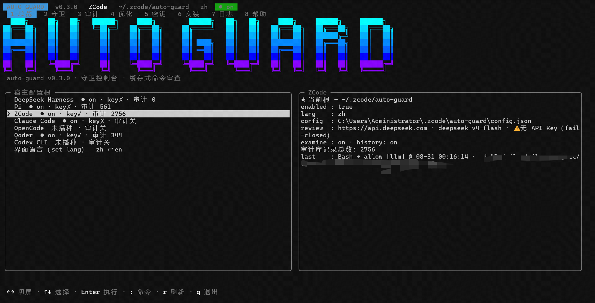

# auto-guard（缓存式自动命令审查）

[English](README.md) | 简体中文

面向 AI 编码 agent 的**命令审查安全网**。在宿主执行命令或读写文件之前，auto-guard 用分层静态规则、多级缓存、学习规则、审计历史与一次性 LLM 审查（默认 DeepSeek）给出 **allow / deny / ask** 裁决。它设计为叠在 full-access 模式之上：危险命令直接拦，常规命令毫秒级放行，只有真正拿不准的才交给 LLM 或人工。



## 开发缘由

- full-access 模式用着爽但心里没底。现有的 LLM 审批机制（Claude Code 的 auto mode、Codex 的 auto-review）每条命令都过一遍模型，又慢又费 token。
- 实际观察下来，agent 的 shell 命令大多是安全、简单且高度重复的。所以审查提示词刻意精简（不带上下文内容），凡是裁决过的命令都由多级缓存直接命中。短期日常使用实测，**审查费用控制在整体费用的 1%–4%**，且随历史积累持续下降。
- 延迟由层级而非 LLM 主导：白名单与缓存命中完全不经过模型，守卫在体感上几乎不存在。

## 安装

auto-guard **没有发布到 npm**——本仓库是 private 的 pnpm workspace，包之间用 `workspace:*` 互相依赖（该协议只在 workspace 内可解析），所以 `npm i -g git+…` 也装不了。clone 本仓库后用 Node ≥ 22.18 直接跑 TypeScript 入口即可（core 本体零运行时依赖——SQLCipher 审计库是可选原生依赖，缺失时自动降级）。Windows 与 macOS 步骤完全一致：

```bash
git clone https://github.com/Ayle5678/auto-guard.git
cd auto-guard
pnpm install
pnpm build                                   # 产出 dist/——zcode/claude/opencode/qoder/codex 的 hooks 指向它
node packages/cli/src/auto-guard.ts init     # 安装器：检测本机宿主、复选框勾选、写入集成
node packages/tui/src/tui.ts                 # 同一套命令面的全屏 TUI
# 非交互：node packages/cli/src/auto-guard.ts init --host pi,zcode --yes
```

下文把 `node packages/cli/src/auto-guard.ts <命令>` 简写为 `auto-guard <命令>`（构建后也可用 `node packages/cli/dist/auto-guard.js`）。想把简写变成真正的全局命令，按 [CLI 指南](docs/cli.md) 软链入口脚本即可。

> **平台支持**（[ADR-0017](docs/adr/0017-platform-support-windows-macos.md)）：Windows + macOS。macOS 已通过逐文件代码审计（2026-08-30），真机验证进行中——验证结论回写前不标「已验证」。Linux 不承诺也不禁止（同为 POSIX 路径与回退，未验证）。

交互 `init` 先展示块状大字头图（tagline 双语），随后弹双语提问（请选择语言 / Select language——`1` 中文默认、`2` English）。选择立即落盘为机器默认（`~/.auto-guard/config.json`）——之后再跑 `init` 不再提问，`remove` 也保留该偏好。全产品双语（安装器、管理 CLI、引擎提示、宿主会话提示、LLM 裁决理由），统一四层解析：环境变量 `AUTO_GUARD_LANG` → 各宿主 `set lang <zh|en>` → 机器默认 → 中文兜底；`[删除理由]` 是协议标记，永远保持中文。

每次写入前展示 diff、强制备份为 `*.auto-guard.bak`、写后校验——重复 `init` 幂等（交互终端下带块状大字头图，青→蓝→紫逐行渐变 + ANSI Shadow 式双线立体钩边，`NO_COLOR` 退化为无色版）。装完在**新会话**中验证（ZCode / Claude Code / Qoder / Codex hooks 无热重载）：`auto-guard guard status` 会总览全部宿主的状态；`auto-guard list` 查看检测证据与接入状态；`auto-guard remove [--host …]` 完整卸载（还原备份；`~/.<host>/auto-guard/` 数据保留）。详见[使用手册](docs/usage.md) · [CLI 指南](docs/cli.md) · [故障排查](docs/troubleshooting.md)。

> **⚠ Claude Code 用户**：cc-switch / clawd 等切换器会**整体覆写** `~/.claude/settings.json`，可能把 hooks 一并抹掉。守卫失效时先检查该文件，再重跑 `auto-guard init --host claude` 恢复；可用 `node <host-claude>/dist/cli.js guard ping` 自检 hook 是否存活。

> **⚠ Codex 用户**：装完在 Codex 里执行一次 `/hooks`，信任 auto-guard 的两条条目——未信任的 hook 会被静默跳过，守卫看似开启实则没跑。ask 类裁决按**拒绝**落地：Codex 的 hook 协议暂不支持弹出人工确认（SPEC 0015）。

> **⚠ OpenCode 用户**：(1) `opencode --version` 报 "postinstall script was not run" 时，运行 `node <npm 全局目录>/node_modules/opencode-ai/postinstall.mjs` 一行修复；(2) `auto-guard remove` 保留插入的 `"*": "ask"` permission 规则（无法区分归属）——需要彻底清理时手工删除各工具对象首位的该键。

各宿主原生渠道继续可用、与安装器并存：

- **ZCode**：安装插件（`packages/host-zcode`，manifest + hooks；`dist/` 预构建）。
- **Pi**：注册扩展（`packages/host-pi/package.json` → `"pi": {"extensions": ["./src/index.ts"]}`；jiti 直跑 TS）。
- **DSH**：安装插件（`packages/host-dsh`）；在聊天栏选择 `auto-guard` 权限预设即开启。
- **Claude Code / OpenCode / Qoder / Codex**：设计上只走安装器（settings.json / hooks.json 合并 / `plugin` 条目 + permission 规则）。Hermes 已调研暂缓——见 `.scratch/0004-host-claude-opencode/research/`；Qoder 协议深查见 `.scratch/0005-host-qoder/research/`；Codex 协议深查见 `.scratch/0015-host-codex/spec.md`。

新增宿主 = 一条 profile + 一个适配层包，不改安装器逻辑（[接入指南](docs/new-host.md)）。

## 设计定位

- **安全网，不是沙箱。** 守卫不限制文件系统，而是在 full access 之上做裁决、尽量不打断正常开发。它不是绝对安全边界——LLM 裁决可能被提示词注入，所以高风险命令永不缓存、敏感文件内容永不送审。
- **处处 fail-closed。** 审查超时、缺 API key、没有确认 UI——所有异常路径都落到拒绝或人工确认，绝不静默放行。（唯一例外：用户显式关闸必须永远有效。）
- **密钥不落仓库。** API key 解析顺序：环境变量 → 加密存储（AES-256-GCM 机器绑定）→ 遗留明文字段（只读，永不回写）。
- **审查模型专属，用多少花多少。** 审查调用只是一条极简 prompt（不带上下文内容），发往任意 OpenAI 兼容端点、走独立的 API key——用 `apiBase` + `set-api` 指向按量计费的便宜供应商（DeepSeek、opencode Zen 等）、`model` 配个小模型即可。审查费用单独计量；规则与缓存裁决过的命令，一分钱不花。

## 裁决管线（所有宿主共用）

每条 shell 命令依次过这些层，先命中先赢：

```text
命令（bash / pwsh）
  → 写后执行追踪        刚写入的脚本被立即执行时物化脚本内容送审（内容疑似敏感则不送 LLM）
  → 绝对黑名单          hard-deny，缓存/学习规则/LLM 均不可推翻
  → 目录删除复核        先拒一次；agent 带 [删除理由] 重试；低推理 LLM 复核恰好一次；
                        非 allow 一律转人工
  → 敏感路径守卫        命令引用 .env / .ssh / *.pem … 时整条降级 LLM（不静默放行、不写缓存）
  → 复合命令            按 ; && || 拆分，取最严子裁决；状态改变命令（export、cd、trap、
                        git config …）强制整条送 LLM
  → 纯管道              整条判定：所有叶子都确定性安全才放行；任一叶子拿不准则整条一次送 LLM
  → 静态白名单          默认白名单 + 用户预授权；放行前做 token 级危险 flag 扫描
    （+ 预授权）        （git branch -D、find -exec …）；命令替换/重定向不走静态路径
  → 会话缓存            LRU，key 为 会话×工作区×命令形态
  → 持久缓存            跨会话、按工作区隔离、按风险 TTL（low 30 天 / medium 7 天 / high 永不）；
                        LLM deny 永不入内
  → 模板缓存            学习放行按骨架匹配，参数变体可命中（--days 7 ≈ --days 8）
  → 历史判断层          同一骨架近期多次低风险放行且零拒绝 → 免审放行
  → LLM 兜底            未分类命令；任何故障 fail-closed
```

文件操作（`write` / `edit` / `read`）只过敏感路径门禁：命中即 ask 且内容永不出本机，其余直接放行。守卫范围之外的工具调用原样透传。

管线之上还有两个记忆行为：

- **Guard Memory** — LLM deny 永不写缓存；同命令重现时转人工 ask，而不是静默重判。
- **ask 四态**（ask UI 支持的宿主）——仅本次同意 / 本会话都同意 / 拒绝（可输原因）/ 本会话都拒绝。

每条裁决带决策来源标签，通知里可见：`[白名单]`、`[LLM]`、`[黑名单]`、`[会话缓存]`、`[持久缓存]`、`[学习规则]`、`[历史]`、`[删除复核]`、`[写后执行]`、`[敏感路径]`、`[预授权]`。

### 命令分类

| 类别 | 行为 | 示例 | 缓存 |
|---|---|---|---|
| 静态白名单 | 直接放行 | `ls`、`git status`、`git diff`、`git commit` | 否 |
| 绝对黑名单 | 直接拒绝 | `rm -rf /`、`mkfs`、`dd of=/dev/...` | 否 |
| 目录删除复核 | agent 理由 + 低推理 LLM 复核一次 | `rm -rf ./dist`、`Remove-Item -Recurse` | 否 |
| 用户预授权 | 用户主动声明"永远放行" | `git push` | 否 |
| 可缓存类 | LLM 放行后按 TTL 缓存 | `npm run build`、`npm test` | 是 |
| 必审类 | 每次都过 LLM；allow 只进短时会话缓存 | `npm install`、`Invoke-Expression`、`curl \| bash` | 仅会话 30 分钟 |
| 未分类 | LLM 裁决；low/medium 放行可入缓存 | 其余命令 | low/medium 可缓存 |

### 缓存、学习与审计

- **学习规则** — 对审计库做离线确定性分析，把反复安全出现的命令沉淀为 cacheable 模板（`learned-rules.json`，优先级最低，绝不学出 static-allow；每次写盘前备份、可回滚）。手动触发或每 15 天自动分析，默认关闭。
- **守卫统计** — 会话内按层计数（LLM 调用、缓存/规则/历史命中）。纯内存，会话结束清零。
- **审计库** — 可选（默认关闭）的本地加密 SQLite，只记录 shell 命令裁决：落库前脱敏，不记录文件工具、不记录执行输出。它是历史层与规则学习的数据源。

## 一个核心裁决引擎 + 七个薄宿主适配层

- **`@auto-guard/core`** — 零宿主依赖的裁决引擎：裁决管线、规则、缓存、key 水合、审计、历史层、学习规则、管理操作层。仅依赖 Node 内置模块（ADR-0002）。
- **`auto-guard` (packages/host-dsh)** — DeepSeek Harness 插件（`tools/pre-execute`、权限预设开关、SQLCipher 审计、设置页 + Typert remote）。
- **`@auto-guard/host-pi`** — Pi Coding Agent 扩展（`tool_call` / `user_bash`，四态 ask）。
- **`@auto-guard/host-zcode`** — ZCode PreToolUse hook 插件（一次一进程、磁盘会话态、决策历史）。
- **`@auto-guard/host-claude`** — Claude Code PreToolUse hook 适配层（settings.json hooks、NotebookEdit 覆盖、原生确认框）。
- **`@auto-guard/host-opencode`** — OpenCode 权限系统适配层（插件监听 `permission.asked` 事件、每次裁决 spawn `node`、原生 TUI ask；守卫面 = 宿主 ask 面，非全量审查，详见[适配现状](#auto-guardhost-opencode--opencode-权限系统适配层)）——见 [ADR-0015](docs/adr/0011-opencode-permission-ask-delegation.md)。
- **`@auto-guard/host-qoder`** — Qoder（国际版 IDE）PreToolUse hook 适配层（Claude 兼容 hook 协议、工具双命名映射、原生确认框）。
- **`@auto-guard/host-codex`** — OpenAI Codex CLI hooks 适配层（Claude 兼容 `hooks.json` 协议、apply_patch 补丁文本路径提取；ask 类裁决按拒绝处理——codex 对不支持的 `"ask"` 会弃用并继续执行，SPEC 0015，详见[适配现状](#auto-guardhost-codex--openai-codex-cli-hooks-适配层)）。
- **`@auto-guard/cli`** — 统一 `auto-guard` 管理 CLI 与安装器。
- **`@auto-guard/tui`** — 全屏交互管理控制台（`auto-guard-tui`，SPEC 0009 / ADR-0014）：零依赖手写 ANSI TUI，覆盖全部命令面（安装器 + guard/set/examine/optimize），另设 `:` 命令模式直通任意 CLI 命令。为没有设置 UI 的宿主（zcode/claude/opencode/qoder/codex/pi）而生，DSH 用户同样可用。所有动作经 `runCli`/`runInstallerCommand` 执行（语义单一来源）；非 TTY 启动拒绝（exit 2）。

七个宿主跑同一条管线、同一套默认值、同一套规则文件；不同的只是集成外壳（见[宿主适配层](#宿主适配层)）。

## 宿主适配层

适配层只做两件事：把宿主事件翻译成 `GuardRequest`，把裁决翻译回宿主决策协议；全部裁决逻辑在 core。每宿主独立配置根——`~/.dsh/auto-guard/`、`~/.pi/auto-guard/`、`~/.zcode/auto-guard/`、`~/.claude/auto-guard/`、`~/.config/opencode/auto-guard/`、`~/.qoder/auto-guard/`、`~/.codex/auto-guard/`——宿主之间零共享，升级零迁移。

| 维度 | host-dsh | host-pi | host-zcode | host-claude | host-opencode | host-qoder | host-codex |
|---|---|---|---|---|---|---|---|
| 集成事件 | `tools/pre-execute` + 单调守卫 | `tool_call` + `user_bash` | PreToolUse hook（一次一进程）+ SessionStart | PreToolUse hook + SessionStart（settings.json，`type: "command"`） | 宿主权限系统：安装器写 `bash/edit/read → "*": "ask"` 规则；插件应答 `permission.asked` 事件 | PreToolUse hook + SessionStart（settings.json，`type: "command"`） | PreToolUse hook + SessionStart（hooks.json，`type: "command"`） |
| 决策协议 | PreToolDecision deny/ask + `next()` | `{block, reason}` / input 改写 | stdout JSON `permissionDecision`；allow=静默 | stdout JSON `permissionDecision`；allow=静默 | spawn CLI 输出 `{status}` → `client.permission.reply`（allow→once、deny→reject、ask→不答复） | stdout JSON `permissionDecision`；allow=静默 | stdout JSON `permissionDecision`；allow=静默 |
| ask 风格 | 宿主一次性审批 | 四态确认框 | 委托原生权限确认框 | 委托原生确认框 | 委托原生 TUI（一次 / 本会话总是 / 拒绝） | 委托原生确认框 | **按拒绝落地**——codex 对 `"ask"` 弃用并继续执行，ask 绝不出 wire（headlessFallback: deny） |
| 启停 | 权限预设（`auto-guard`）——唯一开关 | `/guard on\|off` + `config.enabled` | `config.enabled`（`/guard off` 永远有效） | `config.enabled`（`guard off` 永远有效） | `config.enabled`（`guard off` 永远有效） | `config.enabled`（`guard off` 永远有效） | `config.enabled`（`guard off` 永远有效） |
| 会话态 | 内存 | 内存 | 磁盘（`sessions/<sid>/`） | 磁盘（`sessions/<sid>/`） | 磁盘（`sessions/<sid>/`） | 磁盘（`sessions/<sid>/`） | 磁盘（`sessions/<sid>/`） |
| 通知 | page 事件 / context 注入 | `ctx.ui.notify` / `sendMessage` | 拉式决策历史（`guard recent`） | 拉式决策历史（`guard recent`） | 拉式决策历史（`guard recent`） | 拉式决策历史（`guard recent`） | 拉式决策历史（`guard recent`） |
| 配置根 | `~/.dsh/auto-guard/` | `~/.pi/auto-guard/` | `~/.zcode/auto-guard/` | `~/.claude/auto-guard/` | `~/.config/opencode/auto-guard/` | `~/.qoder/auto-guard/` | `~/.codex/auto-guard/` |
| 命令面 | 设置 UI + Typert remote（无 slash 命令） | `/guard` `/guard-set` `/guard-examine` `/guard-optimize` | `commands/*.md` 教模型调 CLI | 无（安装器 + `node …/dist/cli.js guard …`） | 无（安装器 + `node …/dist/cli.js guard …`） | 无（安装器 + `node …/dist/cli.js guard …`） | 无（安装器 + `node …/dist/cli.js guard …`） |
| 打包 | dsh 插件（client.js + typert + cordis.patch.yml） | pi extensions（jiti 直跑 TS） | 插件清单 + hooks.json + 预构建 dist | 安装器写 `~/.claude/settings.json` hooks（不另发插件） | 安装器追加 `plugin` 条目（dist 目录）+ permission 规则 | 安装器写 `~/.qoder/settings.json` hooks（不另发插件） | 安装器写 `~/.codex/hooks.json`（不另发插件） |
| 审计实现 | SQLCipher（全库加密） | SQLCipher（不可用时降级 Light） | Light（node:sqlite + 字段级 AES-GCM） | Light（node:sqlite + 字段级 AES-GCM） | Light（node:sqlite + 字段级 AES-GCM） | Light（node:sqlite + 字段级 AES-GCM） | Light（node:sqlite + 字段级 AES-GCM） |

已知覆盖面说明（opencode，ADR-0015）：用户自己的 permission allow 规则放行的调用完全绕过守卫；在 TUI 选「本会话总是」也会写入此类规则——守卫的覆盖面等于宿主的 ask 面。

### `auto-guard` (packages/host-dsh) — DeepSeek Harness 插件

- 挂在 `tools/pre-execute`；黑名单裁决额外注册 `ctx.tools.guard()` 单调否决，LLM 不可覆盖。
- **启停 = 对话框权限选择器里的 `auto-guard` 预设**（`danger-full-access` + ask）。这是唯一开关，其他任何地方都不持久化 enabled 标志。
- 配置存于 `~/.dsh/settings.yaml` 的 `auto-guard:` 命名空间，经专属设置页编辑（分组字段、key 只显打码值），并带维护按钮——立即分析 / 查看规则 / 回滚学习规则 / 状态 / 清理审计 / 导出明文审计库 / 新建审计库 / 统计——本地与 **Typert remote** 均可操作。无 slash 命令。
- `apiBase` 留空时审查请求走 DSH 内置 provider 体系（`provider`、`reasoningEffort`、`fallbackProvider`）；填值则直连 OpenAI 兼容端点。
- 审计：**SQLCipher 整库加密**（开启前需设审计密码；支持迁移 / rekey / 导出 / 新建库）。
- 打包：dsh 插件（`client.js` 设置 UI + `typert/` + `cordis.patch.yml`）。

### `@auto-guard/host-pi` — Pi Coding Agent 扩展

- 拦截所有 `tool_call`（bash / pwsh / write / edit / read）**和用户手敲的每条 `user_bash` 命令**（operations 可改写输入）。
- **四态 ask 确认框**（仅本次同意 / 本会话都同意 / 拒绝可输原因 / 本会话都拒绝），用 Pi 原生 UI；目录删除确认走 `ctx.ui.input`，headless 时 fail-closed。
- slash 命令面最全：`/guard`（on/off/status/stats/report）、`/guard-set`（reload / set-key / show-key / clear-key / set-api 向导）、`/guard-examine`（审计）、`/guard-optimize`（学习 + 历史层）。
- 底部状态栏实时显示守卫态：`🛡️ on` · `⚠ no-key`（缺 key，fail-closed）· `审查✗`（上次审查失败）· `off`。
- 通知路由：allow 仅 UI（`ctx.ui.notify`）；deny/ask 另经 `sendMessage` 注入模型上下文，让 agent 知道自己被拦。规则放行即使配置成 context 也强制只走页面。
- 审计：SQLCipher，不可用时降级 Light（字段级 AES-GCM）。
- 打包：pi extension，jiti 直跑 TypeScript 入口。

### `@auto-guard/host-zcode` — ZCode PreToolUse hook 插件

- 一次调用一个进程：全部会话态（会话缓存、写后执行追踪、待决删除复核、待决 deny）落盘在 `~/.zcode/auto-guard/sessions/<sid>/`，一次性进程模型不丢任何状态。
- 裁决经 stdout JSON `permissionDecision` 返回；allow = 静默。ask **委托 ZCode 原生权限确认框**，守卫不自建 UI。缺 API key 时 fail-closed：非白名单命令拒绝，其余照常工作。
- 定位：客户端在权限模式检查之前运行 PreToolUse hook，且 hook deny 无条件拦截——权限下拉仍管原生提示，auto-guard 在它之前独立裁决。
- 无推送通知通道，反馈是**拉式决策历史**：环形 JSONL 记录最近裁决及命中详情，用 `guard recent` 查看。
- slash 命令（`/guard`、`/guard-examine` 等）是 `commands/*.md`，教模型调用自带 CLI；API key 只接受真实终端里回显禁用的 `set-key` 输入，AES-256-GCM 存 `api-key.json`——绝不作为 CLI 参数或聊天输入出现。
- 审计：Light（node:sqlite + 字段级 AES-GCM）。
- 打包：插件 manifest + `hooks/hooks.json` + 预构建 `dist/`；SessionStart hook 重读配置。

### `@auto-guard/host-claude` — Claude Code PreToolUse hook 适配层

- 沿用 zcode 适配层的一次一进程模型：会话态落盘在 `~/.claude/auto-guard/sessions/<sid>/`，裁决经 stdout JSON `permissionDecision` 返回，allow = 静默。
- hooks 写在 `~/.claude/settings.json`，使用 Claude Code 方言（`type: "command"` 单条 shell 命令字符串 + 秒级 timeout）；`Bash` / `Read` / `Write` / `Edit` 之外还覆盖 `NotebookEdit`。
- ask 委托 Claude Code 原生确认框，守卫不自建 UI；缺 API key 时 fail-closed。
- 无 slash 命令面；管理走 `node <host-claude>/dist/cli.js guard …`。
- ⚠ cc-switch / clawd 等切换器会整体覆写 `~/.claude/settings.json`，可能抹掉 hooks——重跑 `auto-guard init --host claude` 恢复。

### `@auto-guard/host-qoder` — Qoder PreToolUse hook 适配层

- 镜像 claude 适配层的一次一进程模型：会话态落盘 `~/.qoder/auto-guard/sessions/<sid>/`，裁决经 stdout JSON `permissionDecision` 返回（allow = 静默）；ask 委托 Qoder 原生确认框。
- 只支持**国际版 Qoder IDE**（`~/.qoder/`）；CN 版（`~/.qoder-cn/`）与 Qoder CLI 入口不适配、不验证。hooks 写在用户级 `~/.qoder/settings.json`（`type: "command"` + 秒级 timeout，与 Claude Code 方言同构）；该配置文件在 IDE/CLI 入口间共享，CLI 若支持同名事件也会执行本守卫——接受的副作用，不另做适配。
- 工具双命名全覆盖：`Bash|Read|Write|Edit` 短名 + `run_in_terminal|read_file|create_file|search_replace` 长名 + `apply_patch` 别名；matcher 用 Qoder 自带插件的管道分隔式。Qoder 特有的 `delete_file` 工具合成为单文件 bash `rm "<路径>"` 守卫——与真实 bash `rm` 完全同流（LLM 必审、敏感路径降级、fail-closed）。
- hooks 无热重载，装完必须**新开 Qoder 会话**；无 slash 命令面，管理走 `node <host-qoder>/dist/cli.js guard …`。

### `@auto-guard/host-opencode` — OpenCode 权限系统适配层

- 经 opencode 权限系统集成（ADR-0015）：安装器在 `permission` 下 `bash` / `edit` / `read` 工具对象**首位**插入 `"*": "ask"`（对象语法后匹配者胜，用户规则保持优先），并把 dist 目录追加进 `plugin`。
- 插件监听 `permission.asked` 事件，每次裁决 spawn `node`；裁决映射 allow→once、deny→reject、ask→不答复（原生 TUI 负责一次 / 本会话总是 / 拒绝）。
- 覆盖面说明：permission allow 规则放行的调用完全绕过守卫——TUI 选「本会话总是」即写入此类规则；守卫覆盖面等于宿主的 ask 面。
- `auto-guard remove` 保留插入的 `"*": "ask"` 规则（无法区分归属）——彻底清理需手工删除。
- **与 claude / zcode 的语义差异**：那两个宿主的 PreToolUse hook 独立于权限系统，宿主开完全放行（bypassPermissions / 完全访问）后守卫仍全量审查；opencode 没有这种通道，守卫挂在权限系统**内部**——`"*": "ask"` 就是守卫入口，**不要把它改成 allow**：没有 ask 规则就没有 `permission.asked` 事件，守卫全盲，等于没装。
- **版本锚定与维护立场**：适配按 opencode 1.18.19 实测交付——当时 `permission.ask` 插件 hook 只有类型定义、宿主从不派发（[issue #7006](https://github.com/anomalyco/opencode/issues/7006)，其实现保留作前向兼容），实际通道 `permission.asked` 事件形状未文档化。**本项目不跟踪 opencode 的后续版本**：升级 opencode 后若守卫失效（不弹审查 / 事件不触发），请回退版本或自行修配。欢迎 fork 或让 AI 按 [ADR-0015](docs/adr/0011-opencode-permission-ask-delegation.md) 与[接入指南](docs/new-host.md)改造适配层——改造成本不高，入口逻辑都收敛在 `src/plugin.ts`。

### `@auto-guard/host-codex` — OpenAI Codex CLI hooks 适配层

- hooks 写在 `~/.codex/hooks.json`（Claude 兼容方言：matcher 正则 + `type: "command"` + 秒级 `timeout`；不碰 config.toml 内联 `[hooks]` 层）；配置根 `~/.codex/auto-guard/`（[SPEC 0015](.scratch/0015-host-codex/spec.md) / [ADR-0018](docs/adr/0018-codex-host.md)）。
- 覆盖面：shell / unified exec 以 `Bash` 名义进 hook；文件编辑走 `apply_patch`（含 `Edit`/`Write` 别名）。适配层解析 V4A 补丁文本，**每一条** `*** … File:` 目标路径都过敏感路径门——补丁第二个文件里藏着 `.env` 也逃不掉。MCP 与托管工具（web_search 等）v1 透传；codex 没有独立读文件工具，read 不接。
- **ask 按拒绝落地**：codex 能解析 `permissionDecision:"ask"` 但不支持——hook 标记失败、工具调用**继续执行**（fail-open）。适配层因此绝不发 `"ask"`（能力声明 `headlessFallback: 'deny'`，dsh 先例）：ask 类裁决以 deny 形式到达模型，理由里说明原因与出路（手动执行 / 加入 userConfirmed）。
- **信任门**：非托管 hook 首次运行前必须在 Codex 里执行一次 `/hooks` 审查信任——未信任的 hook 被**静默跳过**（守卫看似开启实则没跑）。ChatGPT.app 内置的 codex 二进制（桌面 App）与 CLI 共享 `~/.codex` 与同一 hook 运行时，同一份 hooks.json 对 App 会话同样生效；App 内的信任流尚未实机验证。
- 已按 codex-cli 0.151.0 真机验证（2026-08-30）：apply_patch 触 `.env` 被拦、理由到达模型；`git status` 静默放行；两条裁决都落 `~/.codex/auto-guard/decision-history.jsonl`。

## 命令行操作

全部宿主共用一套命令面：安装器（`init` / `list` / `remove`）+ 四个管理组（`guard` / `set` / `examine` / `optimize`）。每个宿主不同的只是 **CLI 在哪**、**指向哪个配置根**。

### 统一 CLI —— 一个入口管所有宿主

用 `--config-root` 选宿主（→ 环境变量 `AUTO_GUARD_CONFIG_ROOT` → 自动探测，见[配置](#配置)）：

```bash
auto-guard guard status                                  # 多宿主状态总览
auto-guard set set-key --config-root ~/.pi/auto-guard    # 指向单个宿主
# `auto-guard` 即 node packages/cli/src/auto-guard.ts <命令>（Node 22.18+ 可直跑 TS）
# 或构建产物：node packages/cli/dist/auto-guard.js <命令>
```

### 各宿主自带 CLI —— 构建期绑定配置根，免 flag

ZCode、Claude Code、OpenCode、Qoder 四个适配层还各自带一个 `dist/cli.js`，编译期就绑定本宿主的配置根——直接运行，不需要 `--config-root`：

| 宿主 | 命令 | 作用根 |
|---|---|---|
| ZCode | `node <host-zcode>/dist/cli.js guard status` | `~/.zcode/auto-guard` |
| Claude Code | `node <host-claude>/dist/cli.js guard ping` | `~/.claude/auto-guard` |
| OpenCode | `node <host-opencode>/dist/cli.js guard status` | `~/.config/opencode/auto-guard` |
| Qoder | `node <host-qoder>/dist/cli.js guard status` | `~/.qoder/auto-guard` |

`<host-…>` 即适配层包目录：npm 安装后在 `<npm 全局目录>/node_modules/@auto-guard/host-…`，本仓库内是 `packages/host-…`。确切的绝对路径也在安装器写入的 hook 命令里（`~/.zcode/cli/config.json`、`~/.claude/settings.json`、`~/.qoder/settings.json`、`~/.config/opencode/opencode.json` 的 `plugin` 条目）——同一个 `dist/` 目录下、`hook-cli.js` 旁边就是 `cli.js`。

两种入口的动作完全一致：`guard on|off|status|recent [n]|stats|report [days]|ping`、`set set-key|show-key|clear-key|set-api …|history …|reload`、`examine on|off|status|clear-old|clear-all`、`optimize status|analyze|list|rollback`——完整速查见 [CLI 指南](docs/cli.md)。`guard report` 按裁决种类与决策来源（LLM / 各规则层 / 各缓存层）统计审计窗口。

两个带 UI 的宿主日常不需要终端：

- **dsh**——开关就是权限选择器里的 `auto-guard` 预设（唯一开关）；配置走专属设置页（分组字段、key 打码、维护按钮：立即分析 / 查看规则 / 回滚 / 状态 / 清理审计 / 导出 / 新建审计库 / 统计），本地与 **Typert remote** 均可操作。命令行仍可管这个根的审计与学习：`auto-guard examine on --config-root ~/.dsh/auto-guard`（`guard on/off` 对 dsh 无效——开关只在预设）。
- **pi**——命令面全在会话内：`/guard`（on/off/status/stats）、`/guard-set`（`set-key` 回显关闭向导 / show-key / clear-key / set-api / reload）、`/guard-examine`、`/guard-optimize`。终端等价写法：`auto-guard set set-key --config-root ~/.pi/auto-guard`。

宿主特有的两点：

- **zcode** 的会话内 slash 命令（`/guard`、`/guard-examine` …）是 `commands/*.md`，教模型替你跑自带 CLI；`guard recent 20` 是拉式反馈的查看入口。
- **claude** 的 `guard ping` 是切换器（cc-switch / clawd）抹掉 hooks 后最快的存活自检。

## 配置

全部配置走命令行或直接编辑配置根里的 JSON；**每个宿主一个配置根，互不共享**（Key、审计、学习规则独立）。管理命令的宿主选择：`--config-root <path>` → 环境变量 `AUTO_GUARD_CONFIG_ROOT` → 自动探测（`~/.zcode → ~/.claude → ~/.config/opencode → ~/.pi → ~/.dsh`，取第一个存在的）——装了多个宿主时自动探测只命中一个，给其它宿主做配置要显式指定：

```bash
auto-guard set set-key --config-root ~/.pi/auto-guard   # 给 Pi 配 Key
auto-guard examine on  --config-root ~/.dsh/auto-guard  # 给 dsh 开审计
auto-guard guard status                                # 不带 flag = 多宿主状态总览
```

完整命令面见[使用手册 §3](docs/usage.md#3-管理命令)。

单一超集 schema；各宿主把同一套键播种到各自配置根（路径与前代一致——升级零迁移）：

| 键 | 默认 | 说明 |
|---|---|---|
| `enabled` | `true` | 总开关（pi/zcode）；dsh 用权限预设 |
| `lang` | *(未设)* | 输出语言（`set lang zh\|en`）；未设 = 机器默认，再兜底中文 |
| `apiBase` | `https://api.deepseek.com` | OpenAI 兼容审查端点（dsh：空 = provider 路由） |
| `apiKeyEnv` | `DEEPSEEK_API_KEY` | 环境变量优先于本地存储 |
| `model` / `fallbackModel` | `deepseek-v4-flash` | 审查模型与回退模型 |
| `timeoutMs` | `8000` | 单次请求预算；超时 fail-closed |
| `onTimeout` | `deny` | 服务级兜底策略 |
| `headlessMode` | `deny` | 无 UI 时 ask 的落点（pi/dsh 能力层） |
| `notifyAllow` / `notifyDeny` / `notifyAsk` | `page` / `context` / `context` | 按裁决种类路由 |
| `lowRiskTtlDays` / `mediumRiskTtlDays` | `30` / `7` | 持久缓存 TTL（high 风险永不缓存） |
| `sessionCacheSize` | `256` | 会话 LRU 容量 |
| `alwaysReviewCacheTtlMinutes` | `30` | 必审命令会话内放行的短 TTL |
| `fileTrackerDefault` / `fileTrackerWindowSec` | `ask` / `5` | 写后执行追踪器 |
| `examineEnabled` | `false` | 审计库（默认关闭） |
| `historyEnabled` / `historyDays` | `false` / `60` | 基于审计库的运行时历史层 |
| `autoAnalyzeEnabled` / 各阈值 | `false` / 保守 | 学习 cacheable 规则生成 |
| dsh 特有 | — | `provider`、`reasoningEffort`、`fallbackProvider`、`apiKeyMasked`、`auditPassword`（secret role） |

路径型键（`rulesPath`、`defaultRulesPath`、`cachePath`、`auditDbPath` 等）默认均落在宿主配置根内。

### 规则文件

规则是八类大小写不敏感的 glob 模式列表：`staticAllow`、`hardDeny`、`directoryDelete`、`userConfirmed`、`cacheable`、`alwaysReview`、`staticAllowGuards`、`sensitivePaths`。首次运行时引擎把出厂规则复制为可编辑的 `defaults.json` 播种到配置根；你的 `rules.json` 只写增量——缺失字段自动合并补齐。示例：

```json
{
  "version": 1,
  "staticAllow": [
    { "pattern": "git log", "reason": "Read-only git log" }
  ]
}
```

## 从 dsh-auto-guard / pi-auto-guard / zcode-auto-guard 迁移

auto-guard 是三个复制移植世代（`dsh-auto-guard` 0.2.0 → `pi-auto-guard` 0.1.3 → `zcode-auto-guard` 0.1.0）的延续，现在合并为一个仓库，跨宿主修复一次提交同步全部宿主。迁移：卸载旧插件，用同一宿主渠道安装统一包（或安装器）——配置根、文件名、schema 键全部不变，规则、缓存、学习规则、审计数据原地续用。行为差异逐项见 [differences](docs/differences.md)。

## 开发

```bash
pnpm install
pnpm -r typecheck && pnpm -r test   # 各包 vitest 套件
pnpm smoke                          # 各宿主冒烟脚本
```

`GuardService.decide(GuardRequest)` 是唯一测试 seam；`packages/conformance` 固定五种 bootstrap 风格下裁决语义完全一致。

License: MIT。
